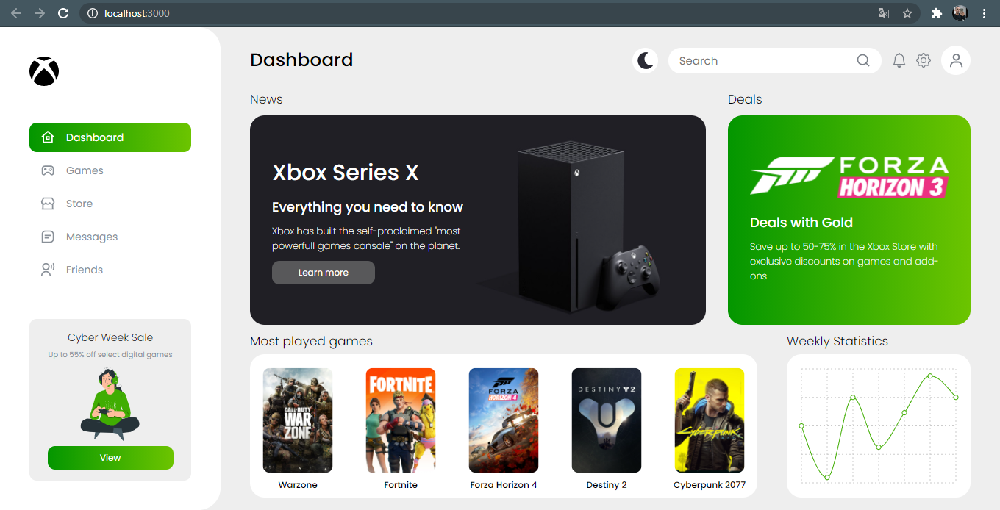
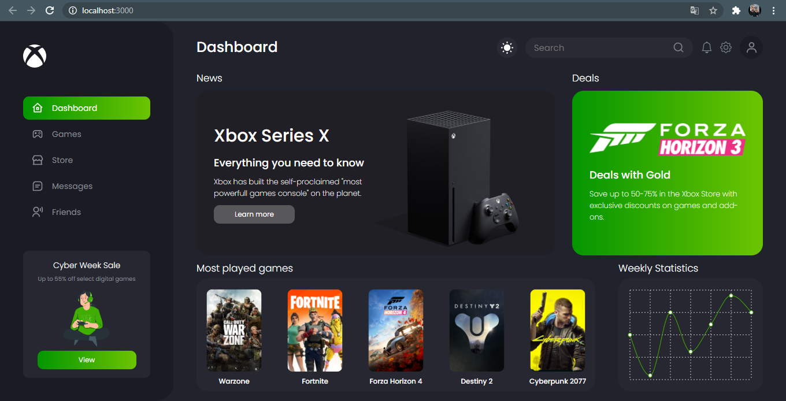

## Xbox Dashboard

The Xbox Dashboard project is part of a personal study with [React.js](https://reactjs.org/). This is an Xbox game dashboard.

---

### Light theme



### Dark theme



#### Credits
UI Designer: [zoltanczekmany](https://dribbble.com/zoltanczekmany)

---

## Technologies

<div align="start">
  <br />
  
</div>

- [React.js](https://reactjs.org/)

<div align="start">
  <br />
  
</div>

- [Sass](https://sass-lang.com/)

---

## Getting started

### Requirements

- You need to install both [Node.js](https://nodejs.org/en/download/) and [Yarn](https://yarnpkg.com/) to run this project.

**Clone the project**

```bash
$ git clone https://github.com/brunomart97/xbox-dashboard.git
```

**Follow the steps**

```bash
# Access the project folder
$ cd xbox-dashboard

# Install the dependencies
$ yarn

# Run the web server
$ yarn start
```

The application will be available at `http://localhost:3000`

---

### Author

<p>
    
    <br />
    <sub><strong>Bruno Martins da Silva</strong></sub>
</p>

<a href="https://www.linkedin.com/in/brunomart97" target="_blank"></a>
